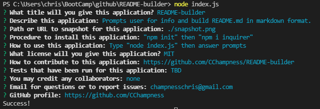

# README-builder

  
  ## Description
  Command-line app written in JavaScript to prompt the user for info to place into a new markdown README .md file.  This README has been biult by the README-builder.  The video link has been added after-the-fact.
  ## Table of Contents
  - [Snapshot](#snapshot)
  - [Installing](#installing)
  - [Usage](#usage)
  - [License](#license)
  - [Contributing](#contributing)
  - [Tests](#tests)
  - [Collaborators](#collaborators)
  - [Questions?](#questions)
  ## License
  This application is provided under the MIT Open Source license
    
  Details: https://opensource.org/licenses/MIT
      
  ## Snapshot
  
  ## Installing
    In the terminal, type "npm init" then "npm i inquirer"
  ## Usage
    In the terminal, type "node index.js" then answer prompts
  ## Contributing
    https://github.com/CChampness/README-builder
  ## Tests
    TBD
  ## Collaborators 
    none
  ## Questions
    Please feel free to contact us
    email: champnesschris@gmail.com
    GitHub profile: https://github.com/CChampness
  